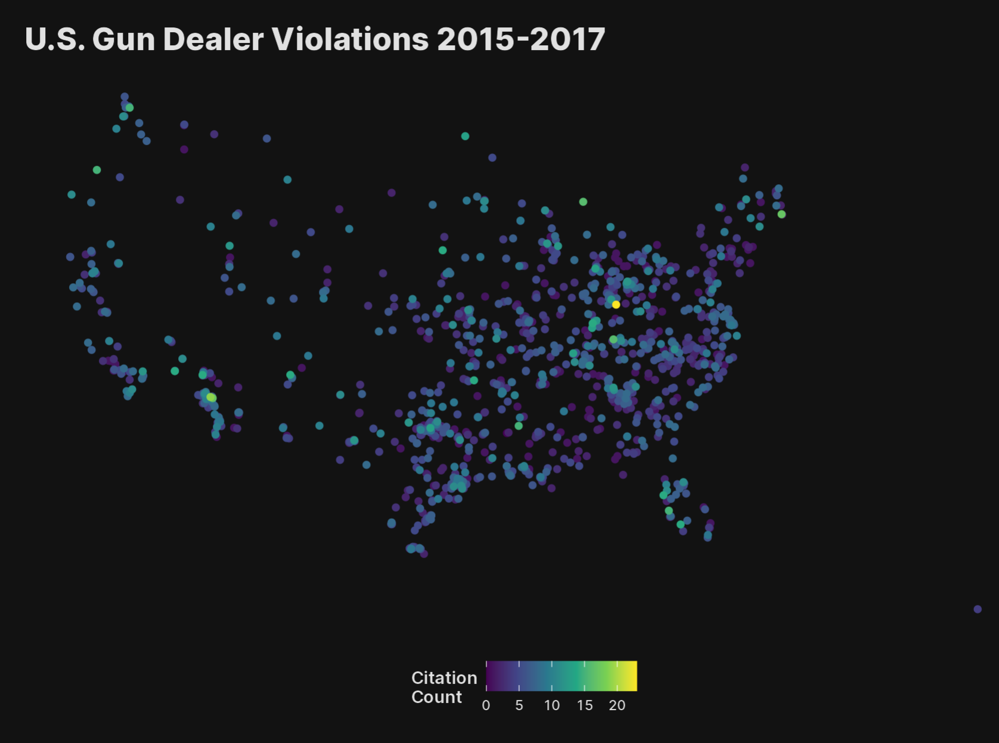

# 2021-gun-dealer-inspections-data
Geocoded version of The Trace &amp; USA Today's ATF Exposé • https://projects.thetrace.org/inspections/

The Trace/USA Today provided the data in CSV format but it did not include the geocoded longitude & latitude. However, that data was available in a `<script>` tag on the page linked above. 14 had no geocoding information from that `<script>` tag and, thus, are not in the geojson version of the data.

The `license_type` field was used to join license description data from <https://www.atf.gov/resource-center/fact-sheet/fact-sheet-federal-firearms-and-explosives-licenses-types>.



```r
library(sf)
library(hrbragg) # github.com/hrbrmstr/hrbragg
library(tidyverse)

atf_df <- st_read("https://github.com/hrbrmstr/2021-gun-dealer-inspections-data/raw/main/atf-inspection-reports-data.geojson")

ggplot() +
  geom_sf(
    data = atf_df %>% 
      distinct(ffl_proprietor_2, citation_count, .keep_all = TRUE) %>% 
      arrange(citation_count),
    aes(color = citation_count)
  ) +
  scale_color_viridis_c(name = "Citation\nCount") +
  coord_sf(crs = 5070 , datum = NA) +
  labs(
    title = "U.S. Gun Dealer Violations 2015-2017"
  ) +
  theme_inter(grid="", mode = "dark") +
  theme(legend.position = "bottom")
  ```
  
